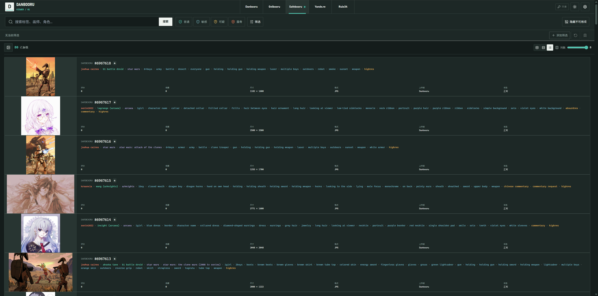
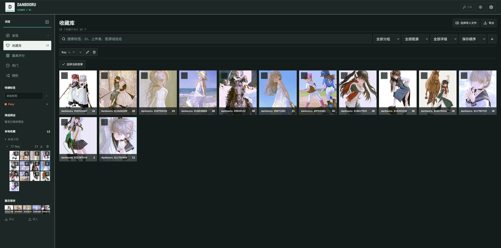
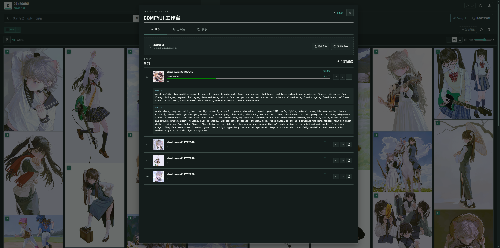
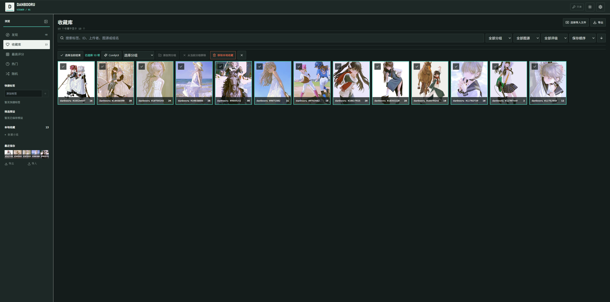

# Danbooru Viewer

**把散落在多个 Booru 图源里的灵感，直接送进本机 ComfyUI。**

[中文](#中文) | [English](#english)
 


Danbooru Viewer 是一个 Manifest V3 浏览器扩展。它把新标签页变成统一的图片发现、整理与生成工作台：在五个 Booru 图源中找图，保留标签和来源上下文，整理到本地收藏，再用冻结的工作流快照发送到 `127.0.0.1` 上的 ComfyUI。

## 中文

### 一条不断线的创作路径

参考图工作流最耗时的部分，往往不是生成，而是反复切站、复制标签、下载文件、寻找工作流窗口，再确认刚才发送的到底是哪一张图。

Danbooru Viewer 把这些步骤收进同一个新标签页：

1. **发现**：用同一套搜索、评级与高级筛选浏览 Danbooru、Gelbooru、Safebooru、Yande.re 和 Rule34。
2. **看清**：缩略图快速扫图，大图按预览、样图或原图渐进加载；滚轮缩放、拖拽查看细节。
3. **留下上下文**：分类标签、作者、来源、分辨率和站点关系与图片一起呈现，标签可直接复制或加入搜索条件。
4. **整理**：图片进入完全本地的收藏库，支持分组、批量整理、搜索和 JSON 导入导出。
5. **生成**：从缩略图、详情、多选结果或整个收藏组直接发送到 ComfyUI；队列在页面关闭后仍可继续执行。

> **截图占位：从发现到详情**  
> 建议内容：左侧大图，右侧分类标签与元数据，突出渐进大图和标签上下文。

### 为什么它适合提示词与参考图工作流

- **五个图源，一套操作**：统一标签搜索、包含/排除条件、自动补全、快捷标签和可排序筛选预设。
- **不是只有缩略图**：详情与 ComfyUI 工作台的输入放大均加载高质量资源；原图失败时按样图、预览图回退。
- **标签直接进入工作流**：复用可配置的五类标签格式，把最终文本写入所有 `REVERSE` 节点。
- **发送时冻结上下文**：工作流 JSON、OPTION 值、标签和输入引用在入队时形成快照，之后修改预设不会改变已排队任务。
- **可靠的本地队列**：串行执行，显示当前节点、进度和耗时；支持排序、删除、取消、失败重试、断线等待和后台恢复。
- **输出仍在眼前**：工作台集中查看图片与文本输出、放大结果和历史记录，可选择是否缓存输出。
- **隐私边界明确**：没有分析、遥测或项目服务器；ComfyUI 仅允许 `127.0.0.1`，不申请任意网页访问和系统通知权限。





### ComfyUI 快速开始

1. 启动本机 ComfyUI，默认地址为 `http://127.0.0.1:8188/`。
2. 在 ComfyUI 中导出 **API format** JSON，而不是界面工作流 JSON。
3. 打开 Viewer 顶部的 **ComfyUI** 工作台并导入 JSON。
4. 激活工作流，按需填写 `OPTION*` 参数。
5. 在图片缩略图、详情、多选工具栏、收藏组或本地文件区发送任务。

工作流通过节点标题声明接入点：

| 节点标题  | 用途                                                |
| --------- | --------------------------------------------------- |
| `INPUT`   | 接收输入图片；支持多个输入节点                      |
| `OUTPUT*` | 收集图片或文本输出，例如 `OUTPUT1`、`OUTPUT prompt` |
| `REVERSE` | 接收按 Viewer 设置格式化的图片标签                  |
| `OPTION*` | 暴露可保存的文本或整数参数                          |

导入时会校验节点和必需字段。每个输入生成一个独立任务，并允许重复入队。本地静态图直接发送；GIF、视频和 ugoira/ZIP 提取第一帧后进入同一图片上传链路。

### 浏览与收藏能力

- `General`、`Sensitive`、`Questionable`、`Explicit` 四级评级会转换为各图源语法；首次安装只启用 `General`。
- 评分、日期、最低分辨率和排序筛选；虚拟滚动网格、瀑布流和信息列表支持 2-8 列。
- 详情按图源能力展示分类标签、相关标签、图集、父子帖子、评论、投票与远程收藏。
- 本地收藏支持跨组搜索、排序、筛选、批量移动，以及带预览的 JSON 合并或覆盖导入。
- 原图、样图、缩略图和可播放视频下载，支持批量选择与文件名模板。
- 中英文运行时切换、亮色/暗色/跟随系统主题和响应式双列布局。


> 建议内容：分组导航、批量选择工具栏和收藏结果同屏。

### 图源与凭据

| 图源      | 公开浏览 | 凭据                   | 登录后能力           |
| --------- | -------: | ---------------------- | -------------------- |
| Danbooru  |       是 | 用户名 + API Key，可选 | 远程收藏、投票、评论 |
| Gelbooru  |       否 | User ID + API Key      | 搜索、添加远程收藏   |
| Safebooru |       是 | 无                     | 只读                 |
| Yande.re  |       是 | 用户名 + API Key，可选 | 认证只读访问         |
| Rule34    |       否 | User ID + API Key      | 搜索                 |

凭据按图源保存在浏览器扩展存储中，未额外加密，并且只发送给对应图源。Yande.re 没有独立的 `General` 与 `Sensitive` 评级，二者均映射为其 `Safe` 条件。

### 从源码安装

需要 [Node.js](https://nodejs.org/) 20.19 或更高版本及 npm。

```bash
npm ci
npm run build          # Chrome / Edge -> dist/
npm run build:firefox  # Firefox -> dist-firefox/
```

Chrome / Edge：打开 `chrome://extensions/` 或 `edge://extensions/`，启用开发者模式，加载 `dist` 目录。  
Firefox：打开 `about:debugging#/runtime/this-firefox`，选择“临时载入附加组件”，打开 `dist-firefox/manifest.json`。最低版本为 Firefox 140。

### 使用边界

- ComfyUI 仅支持 HTTP(S) `127.0.0.1`，默认端口 `8188`；不支持局域网、远程实例、认证头或绕过自签名证书。
- 运行中取消会在确认后调用实例级 `/interrupt`，可能同时中断该实例上的其他任务。
- `/prompt` 已提交但响应丢失时，任务会标记为需要人工确认，不自动重发，以避免重复生成。
- ComfyUI 任务媒体默认容量上限为 1 GB；活动任务输入受保护。历史默认保留 100 条，可在设置中修改。
- 删除 Viewer 历史只删除本地元数据和缓存，不删除 ComfyUI 服务器上的文件。
- Gelbooru 与 Rule34 必须配置凭据后才能搜索；不同图源支持的元数据和登录后操作并不完全一致。

完整数据范围与权限理由见[隐私声明](PRIVACY.md)。

### 开发与验证

```bash
npm run dev
npm run lint
npm run typecheck
npm test
npm run test:e2e
npm run build:all
npm run validate:artifacts
```

## English

### From reference search to local generation

Danbooru Viewer turns the browser's new tab into one continuous image workflow. Search five Booru sources through one interface, inspect full-quality media with its tag context, organize references in a local library, then send a thumbnail, selection, favorite group, or local file directly to ComfyUI on `127.0.0.1`.

The handoff preserves what matters. Each queued task freezes its API workflow, `OPTION*` values, formatted tags, and input reference. The persistent serial queue keeps running after the Viewer closes, waits through local service outages, restores after background restarts, and brings image and text outputs back into the workbench.

### Product highlights

- Unified search for Danbooru, Gelbooru, Safebooru, Yande.re, and Rule34
- Autocomplete, include/exclude tags, quick tags, reusable filter presets, ratings, score, date, dimensions, and sorting
- Virtualized grid, masonry, and dense list layouts with progressive preview, sample, or original media
- Categorized tags, source metadata, relationships, pools, comments, voting, and remote favorites where supported
- A fully local favorites library with groups, batch organization, search, filtering, and reviewed JSON import
- Direct ComfyUI actions from cards, details, selections, favorite groups, and local files or folders
- API workflow management, editable options, progress, current node, elapsed time, outputs, history, retry, and cancellation
- First-frame normalization for GIF, video, and ugoira/ZIP inputs
- English and Simplified Chinese UI, responsive layouts, and light, dark, or system themes
- No analytics or telemetry; localhost-only ComfyUI access and no arbitrary webpage permission

### ComfyUI convention

Export an **API format** JSON workflow and import it in the workbench. Node titles define the integration contract: `INPUT` receives images, `OUTPUT*` collects image or text results, `REVERSE` receives formatted post tags, and `OPTION*` exposes saved text or integer controls. The default server is `http://127.0.0.1:8188/`.

ComfyUI is intentionally limited to `127.0.0.1`. Running-task cancellation uses the instance-wide `/interrupt` endpoint after confirmation. Ambiguous `/prompt` submissions require manual confirmation instead of automatic retry. Task media uses a configurable 1 GB default local limit, while active inputs are protected from cleanup.

### Build from source

Requires [Node.js](https://nodejs.org/) 20.19 or newer and npm.

```bash
npm ci
npm run build          # Chrome / Edge -> dist/
npm run build:firefox  # Firefox -> dist-firefox/
```

Load `dist` as an unpacked extension in Chromium, or load `dist-firefox/manifest.json` as a temporary add-on in Firefox 140 or newer. See the [privacy notice](PRIVACY.md) for the complete local storage, network, and permission model.

## License

[MIT](LICENSE)
