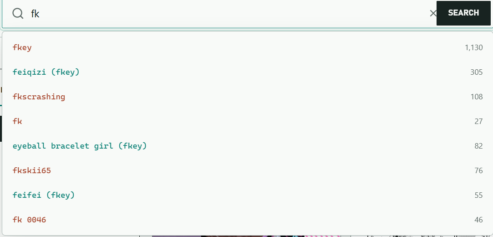

# Danbooru Viewer / Danbooru 图片浏览器

[English](#english) | [中文](#中文)

A Manifest V3 browser extension that turns the new tab page into a fast, image-first Booru workspace.




> Screenshot captured from the live Safebooru API with the `General` rating and `scenery` tag filters enabled.

---

## English

Danbooru Viewer provides one consistent interface for searching, inspecting, collecting, and downloading posts from Danbooru, Gelbooru, Safebooru, Yande.re, and Rule34.

### Highlights

- Five Booru sources behind a normalized browsing interface
- Tag search with autocomplete, include/exclude chips, quick tags, and reusable filter presets
- `General`, `Sensitive`, `Questionable`, and `Explicit` rating filters, translated to each source's rating vocabulary; first installations default to `General` only
- Score, date, minimum resolution, and sort-order filters
- Virtualized grid, masonry, and information-dense list layouts with 2-8 columns
- Responsive two-column layout on compact screens
- Post details with categorized tags, metadata, related tags, pools, parent/child posts, and comments when supported
- Progressive large-image loading with preview, sample, or original quality; wheel zoom, drag-to-pan, and double-click reset
- Local favorites, custom groups, and JSON import/export
- Configurable tag copy for prompt workflows
- Original, sample, thumbnail, and playable-video downloads; batch selection and filename templates
- Light, dark, and system themes
- 24-hour IndexedDB media cache capped at 240 entries

### Supported sources

| Source | Public browsing | Credentials | Authenticated capabilities |
|---|---:|---|---|
| Danbooru | Yes | Username + API key, optional | Remote favorites, voting, and comments |
| Gelbooru | No | User ID + API key | Post queries and adding remote favorites |
| Safebooru | Yes | None | Read only |
| Yande.re | Yes | Username + API key, optional | Authenticated read access |
| Rule34 | No | User ID + API key | Post queries |

Credentials are configured per source from the settings page.

Yande.re exposes only `Safe`, `Questionable`, and `Explicit` ratings, so this extension maps both `General` and `Sensitive` to Yande.re's `Safe` filter.

### Install from source

**Requirements:** [Node.js](https://nodejs.org/) 18 or newer and npm.

```bash
npm install
npm run build          # Chrome / Edge -> dist/
npm run build:firefox  # Firefox -> dist-firefox/
```

**Chrome / Edge**

1. Open `chrome://extensions/` or `edge://extensions/`.
2. Enable **Developer mode**.
3. Select **Load unpacked** and choose the generated `dist` directory.
4. Open a new tab.

**Firefox**

1. Open `about:debugging#/runtime/this-firefox`.
2. Select **Load Temporary Add-on**.
3. Choose `dist-firefox/manifest.json`.

Firefox 109 or newer is required by the extension manifest.

### Basic usage

1. Select a source from the header.
2. Choose a rating filter. New installations start with only `General` selected; select another rating to change the results.
3. Enter one or more tags. Prefix a tag with `-` to exclude it.
4. Open **Filters** for score, date, dimensions, and ordering.
5. Select a card to inspect its media, metadata, and categorized tags.

Hover over a card for about 700 ms to open the tag inspector. Its `+` and `-` controls add include or exclude filters without leaving the grid.

### Keyboard shortcuts

| Key | Action |
|---|---|
| `Ctrl+K` | Focus search |
| `S` | Toggle sidebar |
| `G` / `M` / `L` | Grid / masonry / list layout |
| `1`-`5` | Switch source |
| `Escape` | Close details, or clear filters when details are closed |
| `Left` / `Right` | Previous / next post in details |
| `F` | Toggle local favorite for the current post |
| `D` | Download the current post |
| `Up` / `Down` | Vote on the current post when the source and credentials support it |
| `Ctrl+A` | Select all loaded posts |
| `Ctrl+D` | Download selected posts |

Shortcuts can be disabled in settings.

### Development

```bash
npm run dev        # Vite development server
npm run typecheck  # TypeScript project checks
npm test           # Unit test suite
npm run build      # Production Chromium build
```

The development server exposes local API and media proxies because the unpacked extension normally performs those requests through its Manifest V3 service worker.

### Privacy

Danbooru Viewer contains no analytics or telemetry. Preferences and source credentials are stored in browser extension storage. Favorites, download history, and cached media remain in IndexedDB on the local device. Network requests are made only to the selected Booru source and its media hosts.

### License

[MIT](LICENSE)

---

## 中文

Danbooru Viewer 是一款 Manifest V3 浏览器扩展，把新标签页变成统一的 Booru 图片工作台，可搜索、筛选、查看、收藏和下载 Danbooru、Gelbooru、Safebooru、Yande.re 与 Rule34 的帖子。

### 主要功能

- 统一接入五个 Booru 图源
- 标签自动补全、包含/排除条件、快捷标签和可复用筛选预设
- `General`、`Sensitive`、`Questionable`、`Explicit` 四级评级过滤，并自动转换为各图源的评级语法；首次安装仅默认启用 `General`
- 按评分、日期、最低分辨率和顺序进行高级筛选
- 虚拟滚动的网格、瀑布流和信息列表布局，支持 2-8 列
- 窄屏自动切换为双列布局
- 帖子详情包含分类标签、元数据，以及图源支持时的关联标签、图集、父子帖子和评论
- 大图渐进加载，可选择预览图、样图或原图；支持滚轮缩放、拖拽平移和双击复位
- 本地收藏、自定义分组及 JSON 导入/导出
- 可配置的标签复制格式，适合提示词工作流
- 原图、样图、缩略图和可播放视频下载，支持批量选择与文件名模板
- 亮色、暗色和跟随系统主题
- IndexedDB 媒体缓存，保留 24 小时且最多 240 条

### 图源与凭据

| 图源 | 可公开浏览 | 凭据 | 登录后能力 |
|---|---:|---|---|
| Danbooru | 是 | 用户名 + API Key，可选 | 远程收藏、投票和评论 |
| Gelbooru | 否 | User ID + API Key | 查询帖子和添加远程收藏 |
| Safebooru | 是 | 无需 | 只读 |
| Yande.re | 是 | 用户名 + API Key，可选 | 认证只读访问 |
| Rule34 | 否 | User ID + API Key | 查询帖子 |

每个图源的凭据在设置页中独立保存。

Yande.re 仅提供 `Safe`、`Questionable` 和 `Explicit` 评级，因此扩展会将 `General` 与 `Sensitive` 都映射到 Yande.re 的 `Safe` 过滤条件。

### 从源码安装

**环境要求：** [Node.js](https://nodejs.org/) 18 及以上版本，以及 npm。

```bash
npm install
npm run build          # Chrome / Edge -> dist/
npm run build:firefox  # Firefox -> dist-firefox/
```

**Chrome / Edge**

1. 打开 `chrome://extensions/` 或 `edge://extensions/`。
2. 开启**开发者模式**。
3. 点击**加载已解压的扩展程序**，选择生成的 `dist` 目录。
4. 打开新标签页。

**Firefox**

1. 打开 `about:debugging#/runtime/this-firefox`。
2. 点击**临时载入附加组件**。
3. 选择 `dist-firefox/manifest.json`。

扩展清单要求 Firefox 109 或更高版本。

### 基本使用

1. 在顶部选择图源。
2. 选择评级过滤；首次安装仅默认选中 `General`，可手动改选其他评级。
3. 输入一个或多个标签；在标签前加 `-` 可排除该标签。
4. 打开 **Filters** 设置评分、日期、尺寸和排序。
5. 选择图片卡片，查看媒体、元数据和分类标签。

鼠标在卡片上停留约 700 毫秒会打开标签检查器，可使用 `+` 和 `-` 直接添加包含或排除条件。

### 键盘快捷键

| 按键 | 功能 |
|---|---|
| `Ctrl+K` | 聚焦搜索框 |
| `S` | 显示或隐藏侧栏 |
| `G` / `M` / `L` | 网格 / 瀑布流 / 列表布局 |
| `1`-`5` | 切换图源 |
| `Escape` | 关闭详情；详情关闭时清空筛选 |
| `Left` / `Right` | 在详情中查看上一篇 / 下一篇 |
| `F` | 收藏或取消收藏当前帖子 |
| `D` | 下载当前帖子 |
| `Up` / `Down` | 图源与凭据支持时为当前帖子投票 |
| `Ctrl+A` | 选择全部已加载帖子 |
| `Ctrl+D` | 下载已选帖子 |

可在设置页关闭键盘快捷键。

### 开发与验证

```bash
npm run dev        # 启动 Vite 开发服务器
npm run typecheck  # TypeScript 项目检查
npm test           # 单元测试
npm run build      # 生成 Chromium 正式构建
```

开发服务器提供本地 API 和媒体代理；安装为扩展后，请求由 Manifest V3 Service Worker 处理。

### 隐私

项目不包含分析或遥测。偏好设置和图源凭据保存在浏览器扩展存储中；收藏、下载历史和媒体缓存保存在本机 IndexedDB。网络请求仅发送到当前选择的 Booru 图源及其媒体域名。

### 许可证

[MIT](LICENSE)
